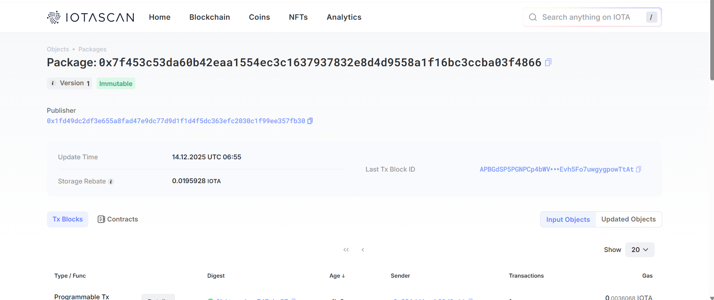

# Social Media dApp

A decentralized social media platform built on IOTA blockchain using Move smart contracts and Next.js.

## ✨ Features

- 🔐 **Decentralized Profiles**: Create and manage your profile on the blockchain
- 📝 **Post Creation**: Share your thoughts with the community
- ❤️ **Social Interactions**: Like and comment on posts
- 👥 **Follow System**: Follow other users and build your network
- ⚡ **Fast & Secure**: Powered by IOTA blockchain technology

## 📍 Contract Address


**Network**: Testnet  
**Package ID**: [0x7f453c53da60b42eaa1554ec3c1637937832e8d4d9558a1f16bc3ccba03f4866](https://iotascan.com/testnet/object/0x7f453c53da60b42eaa1554ec3c1637937832e8d4d9558a1f16bc3ccba03f4866/txs)  
**Module**: `social_media`

## 🚀 Getting Started

### 1. Install Dependencies

```bash
npm install --legacy-peer-deps
```

### 2. Configure Environment

Copy the example environment file and update it with your credentials:

```bash
cp .env.example .env
```

### 3. Run Development Server

```bash
npm run dev
```

Open [http://localhost:3000](http://localhost:3000) in your browser.

## 📁 Project Structure

```
social-media-dapps/
├── contract/
│   └── social_media/          # Move smart contracts
│       ├── sources/
│       │   └── social_media.move
│       └── Move.toml
├── app/                       # Next.js app directory
├── components/
│   ├── sample.tsx            # Main social media UI
│   └── Provider.tsx          # Wallet provider
├── hooks/
│   └── useContract.ts        # Contract interaction hook
└── lib/
    └── config.ts             # Configuration
```

## 🔧 Smart Contract Functions

### User Profile

- `create_profile(username, bio)` - Create a new user profile
- `update_profile(profile, username, bio)` - Update existing profile

### Posts

- `create_post(profile, content)` - Create a new post
- `like_post(post)` - Like a post
- `unlike_post(post)` - Unlike a post

### Social

- `create_comment(post, content)` - Comment on a post
- `follow_user(profile, user_address)` - Follow another user
- `share_post(post, recipient)` - Share a post

## 🎨 UI Features

- **Modern Design**: Gradient backgrounds and smooth animations
- **Responsive Layout**: Works on desktop and mobile
- **Real-time Updates**: Automatic refresh after blockchain transactions
- **User-friendly**: Intuitive interface for Web3 interactions

## 📚 Technology Stack

- **Frontend**: Next.js 16, React 19, TypeScript
- **Blockchain**: IOTA (Move Language)
- **Wallet**: IOTA dApp Kit
- **Styling**: Radix UI, Custom CSS
- **State Management**: React Hooks

## 🔐 Security

All user data is stored on the IOTA blockchain. Users have full ownership and control of their profiles, posts, and social interactions.

## 📖 Learn More

- [IOTA Documentation](https://wiki.iota.org/)
- [Move Language](https://move-language.github.io/move/)
- [Next.js Documentation](https://nextjs.org/docs)
- [IOTA dApp Kit](https://docs.iota.org/developer/iota-101/create-your-first-iota-dapp/)

## 📝 License

MIT
